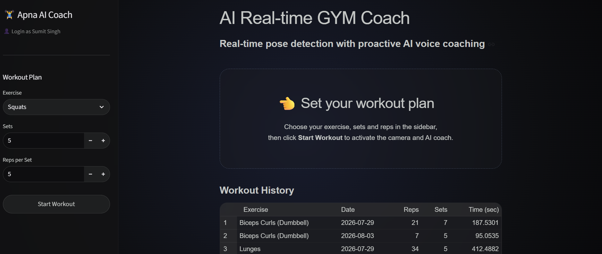

# 🏋️‍♂️ REP-PULSE-AI (Real-time GYM Coach)

> **Your form. Analyzed. Corrected in real-time. Guided by JARVIS.**  
> An AI-powered, low-latency computer vision application that tracks biomechanics, counts reps, and delivers live audio feedback during your workouts.

---

## 📸 Sneak Peek

<p align="center">
  
</p>

---

## ✨ Key Features

* **⚡ Real-Time Pose Tracking:** Sub-100ms latency biomechanical analysis powered by MediaPipe and WebRTC.
* **🎯 Smart Form Correction:** Live alerts on posture breakdowns (e.g., knee collapse during squats, excessive swing during biceps curls, arched back during shoulder presses).
* **🎙️ JARVIS Voice Coach:** Neural text-to-speech engine delivering real-time, hands-free coaching audio feedback.
* **📊 Rep & Set Counting:** Automatic rep validation with per-exercise depth/extension thresholds.
* **📈 Workout Analytics:** Track total volume, workout durations, and history across multiple sessions.
* **🎨 Glassmorphism Interface:** Custom-designed dark-mode UI with smooth input components and responsive styling.

---

## 🛠️ Tech Stack & Architecture

```text
└── Main App/               # Streamlit application (Deployed on Streamlit Cloud)
    ├── main.py
    ├── requirements.txt
    ├── static/             # CSS & local fonts
    └── services/           # Auth, vision pipeline, coaching logic, and DB